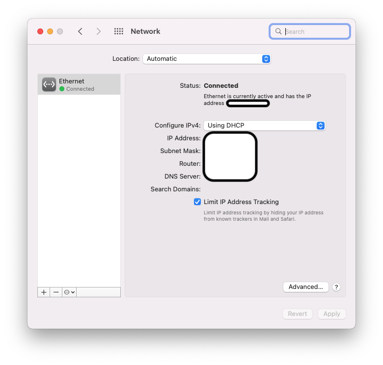
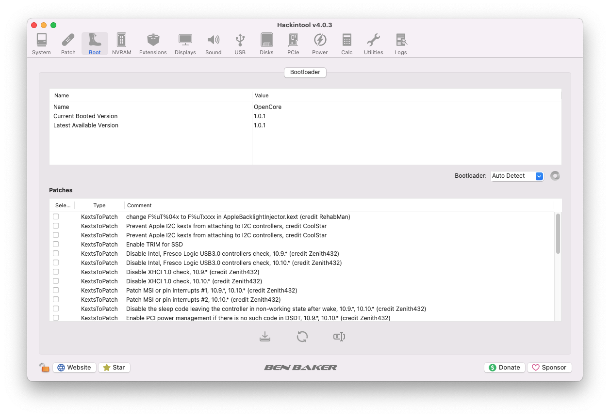
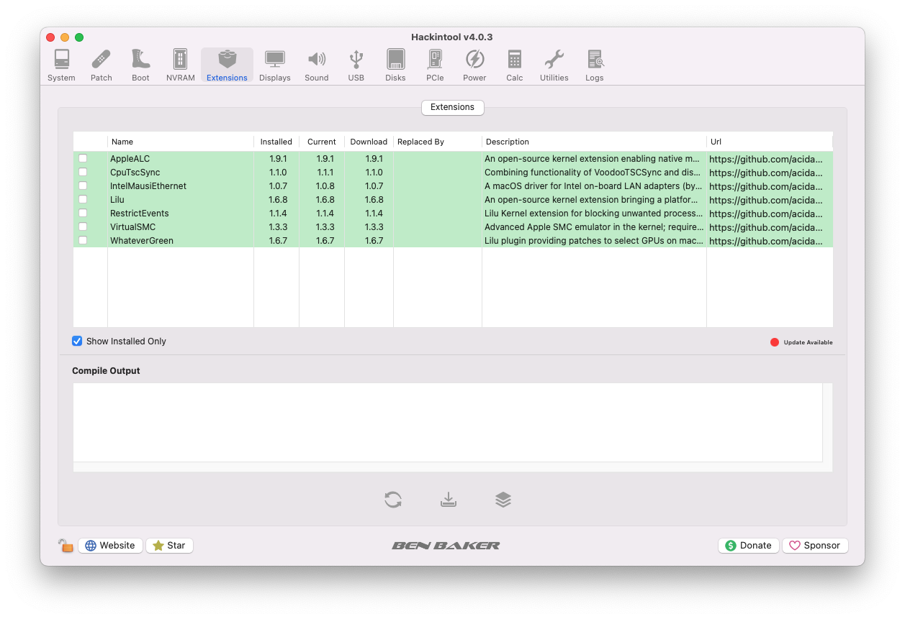

[Português Brasileiro](https://github.com/Gilberto-Mascena/B85M-GAMING-3/blob/main/README-pt_br.md) |
[English](https://github.com/Gilberto-Mascena/B85M-GAMING-3/blob/main/README.md)

# *EFI OC Gigabyte B85M GAMING-3*

---

## *Sistemas operacionais*

  
   
   
     

  

---

_**Minha configuração**_

 - _**Placa mãe**_
   - [*Gigabyte B85M Gaming-3*](https://www.gigabyte.com/br/Motherboard/GA-B85M-Gaming-3-rev-10#ov)
 - _**Versão de BIOS**_
   - *F2*
 - _**CPU**_
   - *Core I3 4170*
 - _**GPU**_
   - *Intel HD Graphics 4400*
> [!NOTE]
> _EFI iGPU somente_

##
   - *RADEON RX 570 RED DRAGON Power Color*
> [!NOTE]
> _EFI dGPU somente_

##

 - _**Memória**_
   - *2x8GB Total 16GB*
 - _**SSD Sata**_
   - *Kingston A400 120GB*
 - _**Rede**_
   - *Intel I217-V*

---

## _Navegação por tópicos_

- [*O que funciona*](#ancora1)
- [*Capturas de telas*](#ancora2)
- [*Kexts usados, (todas releases)*](#ancora3)
- [*Ferramentas recomendadas*](#ancora4)
- [*Configurações de BIOS Intel*](#ancora5)
- [*Agradecimentos*](#ancora6)
- [*Licença* ](#ancora7)

---

<h2>O que funciona 👀</h2>

- [x] *Video (onbord HDMI)*
- [x] *Audio*
- [x] *Rede*
- [x] *USB*
- [x] *Sleep*

[Voltar](#ancora)

## Capturas de telas

 

---

<h2>Audio 👀</h2>

<h2>Rede 👀</h2>

<h2>Periféricos 👀</h2>

<h2>Versão do OpenCore 👀</h2>

<h2>kexts 👀</h2>

<h2>Mapeamento de portas USB 👀</h2>

[Voltar](#ancora)

<h2>Kexts usados, (todas releases) 👀</h2>

- *[`WhateverGreen.kext`](https://github.com/acidanthera/WhateverGreen)*
- *[`Lilu.kext`](https://github.com/acidanthera/Lilu)*
- *[`VirtualSMC`](https://github.com/acidanthera/VirtualSMC), somente: `VirtualSMC.kext`, `SMCProcessor.kext` e `SMCSuperIO.kext`*
- *[`IntelMausi.kext`](https://github.com/acidanthera/IntelMausi)*
- *[`CpuTscSync.kext`](https://github.com/acidanthera/CpuTscSync)*
- *[`AppleALC.kext`](https://github.com/acidanthera/AppleALC)*
- *`USBMap.kext`*

[Voltar](#ancora)

<h2>Ferramentas recomendadas 👀</h2>

* Recomendação 1
  * *Use [`GenSMBIOS`](https://github.com/corpnewt/GenSMBIOS), para gerar novos seriais para seu SMBIOS a fim de evitar conflitos com iServices*
* Recomendação 2
  * *Use [`ProperTree`](https://github.com/corpnewt/ProperTree), para editar seu config.plist*     
* Recomendação 3
  * *Use [`USBMap`](https://github.com/corpnewt/USBMap), para mapear suas portas USB, a partir do OC 0.9.3, elas podem ser mapeadas com XHCIPortLimit habilitado em config.plist + [`USBInjectAll`](https://github.com/Sniki/OS-X-USB-Inject-All/releases)*
* Recomendação 4
  * *Extraia seu DSDT do Windows*
  * *Use [`SSDTTime`](https://github.com/corpnewt/SSDTTime), para gerar seus patches SSDT*    
* Recomendação 5
  * *Use [`MaciASL`](https://github.com/acidanthera/MaciASL), para compilar seus patches SSDT no mac*

[Voltar](#ancora)

<h2>Configurações de BIOS Intel 👀</h2>

- [*OpenCore Install Guide*](https://dortania.github.io/OpenCore-Install-Guide/config.plist/haswell.html#intel-bios-settings)

[Voltar](#ancora)

## 👉 [_Criando o instalador do macOS no Windows ou Linux_](https://github.com/Gilberto-Mascena/How-to-create-a-macOS-installer-without-a-Mac)

## *Agradecimentos*

- [*Acidanthera Team*](https://github.com/acidanthera)
- [*CorpNewt*](https://github.com/corpnewt)
- [*CrisHotpatch*](https://t.me/crishotpatch)
- [*Dortania*](https://dortania.github.io/OpenCore-Install-Guide/config.plist/haswell.html)
- [*Dicas do Mateus*](https://www.youtube.com/c/DicasdoMateus)
- [*Gabriel Luchina*](https://www.youtube.com/c/GabrielLuchina)
- *E outros*

[Voltar](#ancora)

## *Licença* 

[*Licença MIT*](LICENSE.md) (*MIT*)

### Gilberto | Dev _2020_

[Voltar](#ancora)
