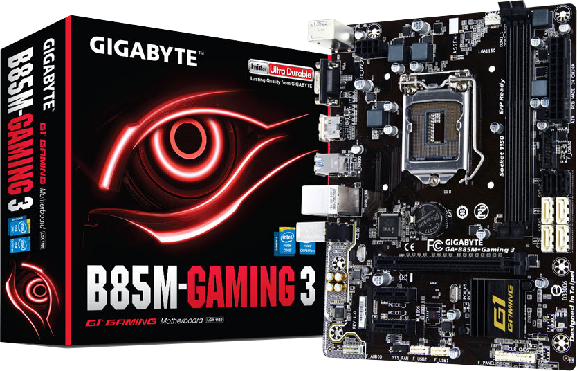

# *EFI OC B85M GAMING-3 macOS Catalina*

##

## *Sistema Operacional*

_**macOS**_  _**Catalina 10.15.7**_

##

_**Meu Setup**_

##

 - _**Placa Mãe**_
   - [*B85M Gaming-3*](https://www.gigabyte.com/br/Motherboard/GA-B85M-Gaming-3-rev-10#ov)
 - _**CPU**_
   - *Core I3 4170*
 - _**GPU**_
   - *Intel HD Graphics 4400*
 - _**Memória Ram**_
   - *2x8GB Total 16GB*
 - _**SSD Sata**_
   - *Kingston A400 120GB*
 - _**Rede**_
   - *Intel I217-V*
##

## *O que funciona*

- [x] *Video (onbord via HDMI)*
- [x] *Áudio*
- [x] *Rede*
- [x] *USB*
- [x] *Sleep*
##

## *Captura de telas*
## *Sobre este mac*
  
## *Hackintool periféricos*
 
##

## *Kexts usadas, (todas versões Releases)*

- *[`WhateverGreen.kext`](https://github.com/acidanthera/WhateverGreen)*
- *[`Lilu.kext`](https://github.com/acidanthera/Lilu)*
- *[`VirtualSMC`](https://github.com/acidanthera/VirtualSMC), somente: `VirtualSMC.kext`, `SMCProcessor.kext` e `SMCSuperIO.kext`*.
- *[`IntelMausi.kext`](https://github.com/acidanthera/IntelMausi)*
- *[`CpuTscSync.kext`](https://github.com/acidanthera/CpuTscSync)*
- *[`AppleALC.kext`](https://github.com/acidanthera/AppleALC)*
- *`USBMap.kext`*
##

## *Utilização*

* Recomendação 1
  * *Use [`GenSMBIOS`](https://github.com/corpnewt/GenSMBIOS), para gerar novos seriais para sua SMBIOS afim de evitar conflitos com iServices.*
* Recomendação 2
  * *Use [`ProperTree`](https://github.com/corpnewt/ProperTree), para editar sua config.plist.*     
* Recomendação 3
  * *Use [`USBMap`](https://github.com/corpnewt/USBMap), para mapear suas portas USB, apartir do OC 0.9.3, pode ser mapeadas com XHCIPortLimit habilitada no config.plist + [`USBInjectAll`](https://github.com/Sniki/OS-X-USB-Inject-All/releases).*
* Recomendação 4
  * *Extrair sua DSDT a partir do windows.*
  * *Use [`SSDTTime`](https://github.com/corpnewt/SSDTTime), para gera seus patches de SSDT.*    
* Recomendação 5
  * *Use [`MaciASL`](https://github.com/acidanthera/MaciASL), para compilar seus patches de SSDT.*
##

## *Agradecimentos*

- [*Acidanthera Team*](https://github.com/acidanthera)
- [*CorpNewt*](https://github.com/corpnewt)
- [*CrisHotpatch*](https://t.me/crishotpatch)
- [*Dortania*](https://dortania.github.io/OpenCore-Install-Guide/config.plist/haswell.html)
- [*Dicas do Mateus*](https://www.youtube.com/c/DicasdoMateus)
- [*Gabriel Luchina*](https://www.youtube.com/c/GabrielLuchina)
- *E outros*
##

## *Licença* 

*The* [*MIT License*](LICENSE.md) (*MIT*)

*Copyright :copyright: 2020*
##