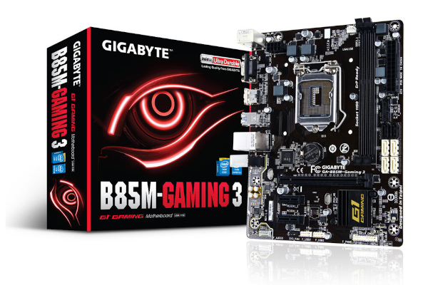

# *EFI OC B85M GAMING-3 macOS Catalina*

##

## *Sistema Operacional*

*macOS* | *Catalina*
:---: | :---
##

## *Meu Setup*

*Config* | *Desktop*
:---: | :---
 Placa Mae | [*B85M Gaming-3*](https://www.gigabyte.com/br/Motherboard/GA-B85M-Gaming-3-rev-10#ov)
 CPU | I3 4170
 GPU | Intel HD Graphics 4400
 Memória Ram | 2x8GB Total 16GB
 SSD Sata| Kingston A400 120GB
 Rede| Intel I217
##

## *O que funciona*

- [x] Video (onbord via HDMI).
- [x] Áudio.
- [x] LAN.
- [x] USB.
- [x] Sleep.
##

## *Captura de telas*
 
  
 
##

## *Utilização*

* Recomendação 1
  * *Use [GenSMBIOS](https://github.com/corpnewt/GenSMBIOS), para gerar novos seriais para sua SMBIOS afim de evitar conflitos com iServices.*
* Recomendação 2
  * *Use [ProperTree](https://github.com/corpnewt/ProperTree), para editar sua config.plist.*     
* Recomendação 3
  * *Use [USBMap](https://github.com/corpnewt/USBMap), para mapear suas portas USB, (apartir do OC 0.9.3, pode ser mapeadas com XHCIPortLimit + USBInjectAll).*
* Recomendação 4
  * *Extrair sua DSDT a partir do windows.*
  * *Use [SSDTTime](https://github.com/corpnewt/SSDTTime), para gera seus patches de SSDT.*    
* Recomendação 5
  * *Use [MaciASL](https://github.com/acidanthera/MaciASL), para compilar seus patches de SSDT.*
##

## *Agradecimentos*

- [*Acidanthera*](https://github.com/acidanthera)
- [*CorpNewt*](https://github.com/corpnewt)
- [*CrisHotpatch*](https://t.me/crishotpatch)
- [*Dortania*](https://dortania.github.io/OpenCore-Install-Guide/config.plist/haswell.html)
- [*Dicas do Mateus*](https://www.youtube.com/c/DicasdoMateus)
- [*Gabriel Luchina*](https://www.youtube.com/c/GabrielLuchina)
##

## *Licença* 

*The* [*MIT License*](https://github.com/Gilberto-Mascena/B85M-GAMING-3/blob/main/LICENSE.md) (*MIT*)

*Copyright :copyright: 2020*
##