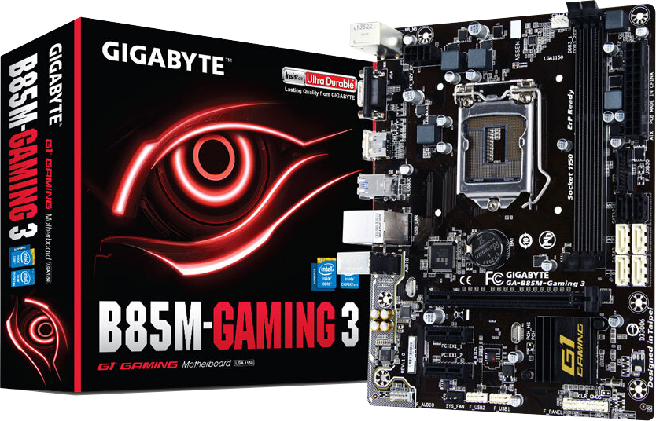
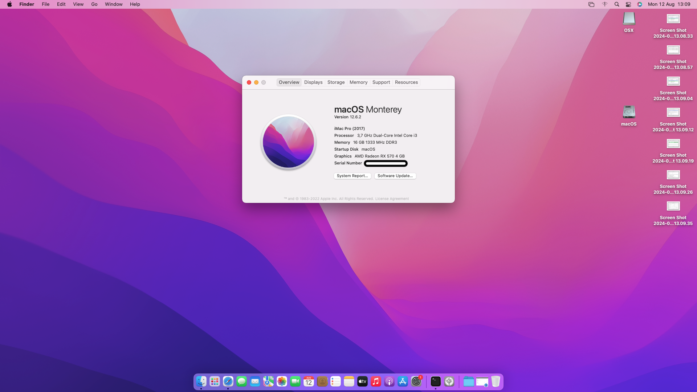
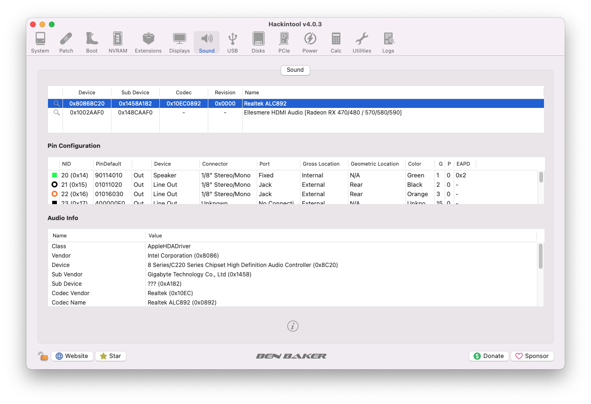
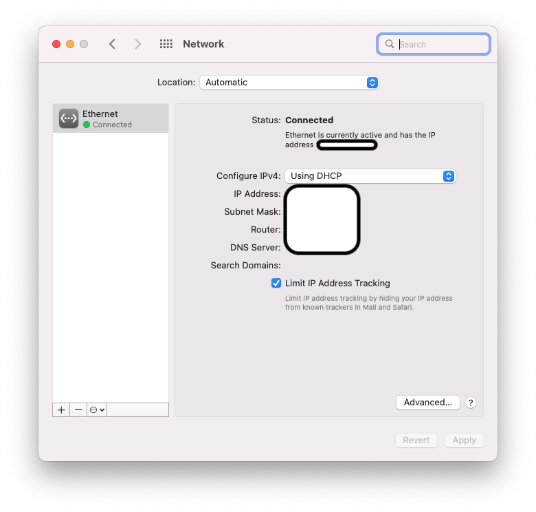
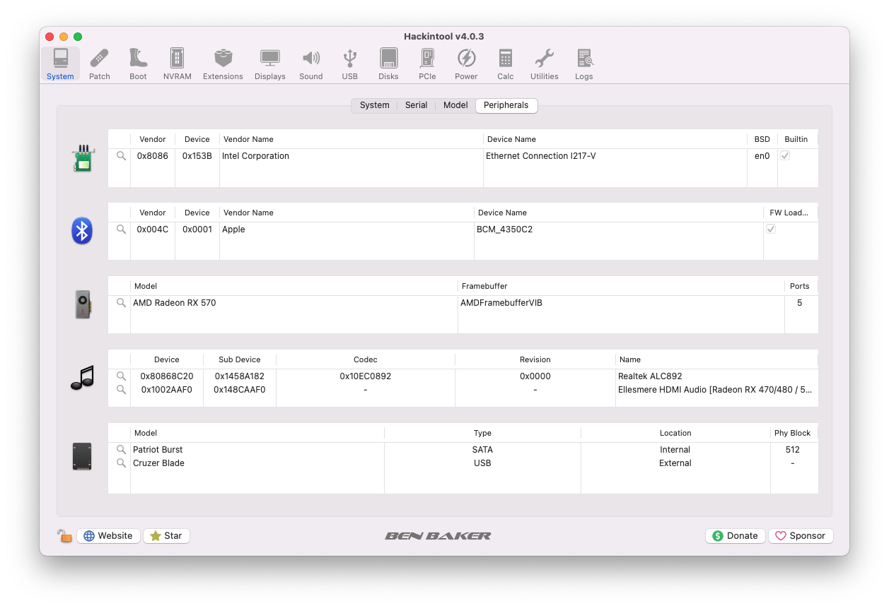
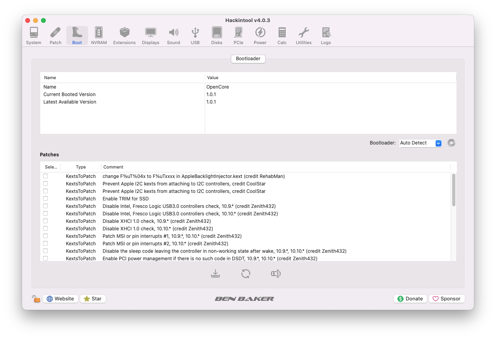
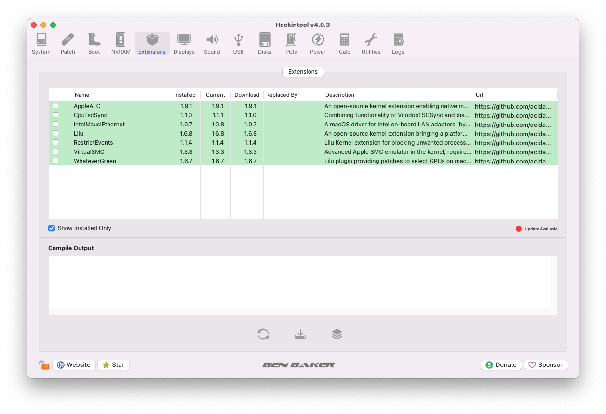
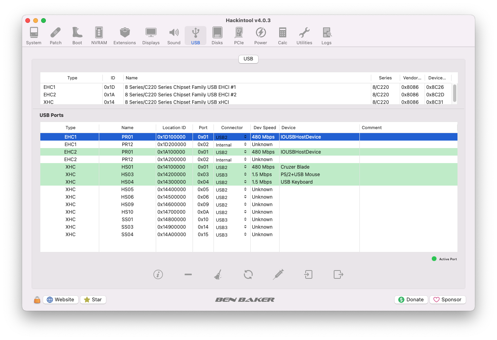

# *EFI OC B85M GAMING-3 macOS Catalina*

---

## *Operational system*

_**macOS**_  _**Catalina 10.15.7**_

---

_**My Setup**_

---

 - _**Motherboard**_
   - [*B85M Gaming-3*](https://www.gigabyte.com/br/Motherboard/GA-B85M-Gaming-3-rev-10#ov)
 - _**CPU**_
   - *Core I3 4170*
 - _**GPU**_
   - *Intel HD Graphics 4400*
 - _**Memory**_
   - *2x8GB Total 16GB*
 - _**SSD Sata**_
   - *Kingston A400 120GB*
 - _**Network**_
   - *Intel I217-V*

---

## Navigation
- [*What works*](#ancora1)
- [*Screenshot*](#ancora2)
- [*Kexts used, (all Releases)*](#ancora3)
- [*Recommended tools*](#ancora4)
- [*Intel BIOS Settings*](#ancora5)
- [*Thanks*](#ancora6)
- [*License* ](#ancora7)

---

## *What works*

- [x] *Video (onbord HDMI)*
- [x] *Sound*
- [x] *Network*
- [x] *USB*
- [x] *Sleep*

[Top](#ancora)

---

## *Screenshot*

 

---

## *Sound*

## *Wired Network*

## *Hackintool peripherals*

## *Hackintool OpenCore Version*

## *Hackintool kexts*

## *Hackintool USB port mapping*

[Top](#ancora)

---

## *Kexts used, (all Releases)*

- *[`WhateverGreen.kext`](https://github.com/acidanthera/WhateverGreen)*
- *[`Lilu.kext`](https://github.com/acidanthera/Lilu)*
- *[`VirtualSMC`](https://github.com/acidanthera/VirtualSMC), only: `VirtualSMC.kext`, `SMCProcessor.kext` and `SMCSuperIO.kext`*.
- *[`IntelMausi.kext`](https://github.com/acidanthera/IntelMausi)*
- *[`CpuTscSync.kext`](https://github.com/acidanthera/CpuTscSync)*
- *[`AppleALC.kext`](https://github.com/acidanthera/AppleALC)*
- *`USBMap.kext`*

[Top](#ancora)

---

## *Recommended tools*

* Recommendation 1
  * *Use [`GenSMBIOS`](https://github.com/corpnewt/GenSMBIOS), to generate new serials for your SMBIOS in order to avoid conflicts with iServices.*
* Recommendation 2
  * *Use [`ProperTree`](https://github.com/corpnewt/ProperTree), to edit your config.plist.*     
* Recommendation 3
  * *Use [`USBMap`](https://github.com/corpnewt/USBMap), to map your USB ports, starting from OC 0.9.3, they can be mapped with XHCIPortLimit enabled in config.plist + [`USBInjectAll`](https://github.com/Sniki/OS-X-USB-Inject-All/releases).*
* Recommendation 4
  * *Extract your DSDT from windows.*
  * *Use [`SSDTTime`](https://github.com/corpnewt/SSDTTime), to generate your SSDT patches.*    
* Recommendation 5
  * *Use [`MaciASL`](https://github.com/acidanthera/MaciASL), to compile your patches into SSDT.*

[Top](#ancora)

---

## *Intel BIOS Settings*

- [*OpenCore Install Guide*](https://dortania.github.io/OpenCore-Install-Guide/config.plist/haswell.html#intel-bios-settings)

[Top](#ancora)

---

## *Thanks*

- [*Acidanthera Team*](https://github.com/acidanthera)
- [*CorpNewt*](https://github.com/corpnewt)
- [*CrisHotpatch*](https://t.me/crishotpatch)
- [*Dortania*](https://dortania.github.io/OpenCore-Install-Guide/config.plist/haswell.html)
- [*Dicas do Mateus*](https://www.youtube.com/c/DicasdoMateus)
- [*Gabriel Luchina*](https://www.youtube.com/c/GabrielLuchina)
- *And others*

[Top](#ancora)

---

## *License* 

*The* [*MIT License*](LICENSE.md) (*MIT*)

*Copyright :copyright: 2020*

[Top](#ancora)

---